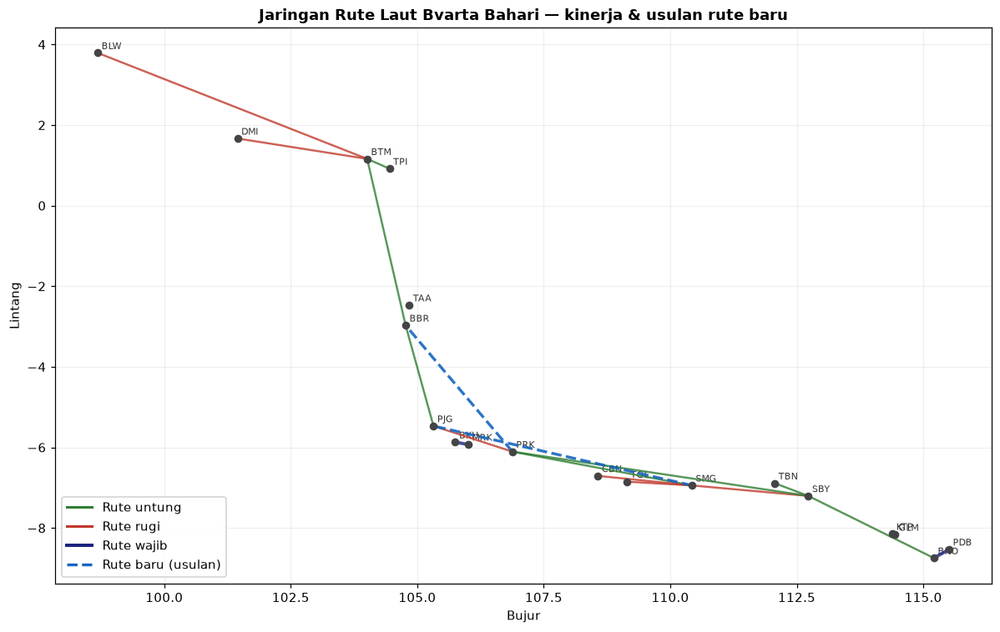
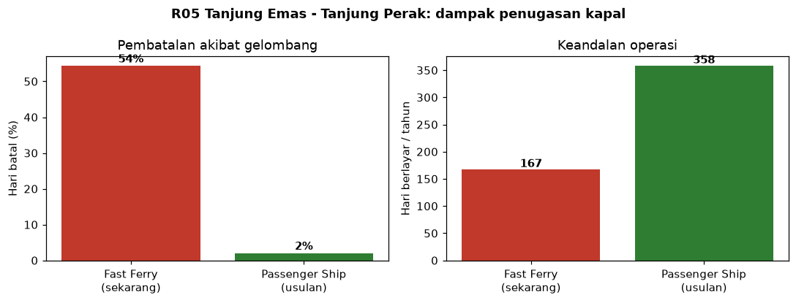
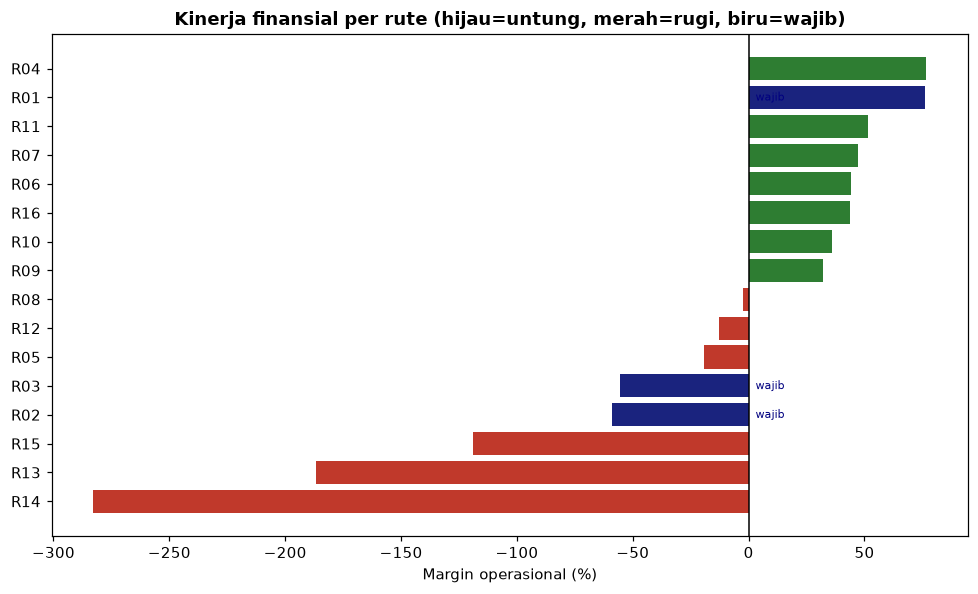
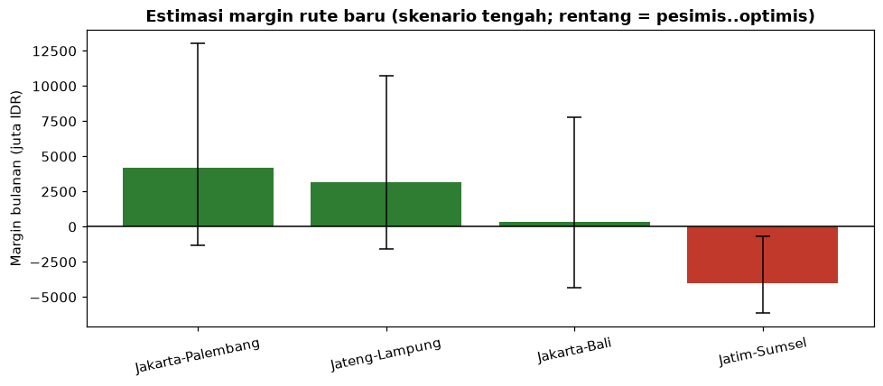

# Bvarta Bahari — Ringkasan untuk Manajemen

Dokumen ringkas hasil evaluasi jaringan rute. Detail teknis ada di writeup; visual pendukung
ada di folder `outputs/` (siap dipakai presentasi).

---

## Gambaran jaringan

Jaringan membentang Sumatera–Jawa–Bali dengan 16 rute. Saat ini **8 rute menguntungkan dan 8
merugi**. Sebagian besar kerugian ternyata bisa diperbaiki — bukan karena rutenya buruk, tapi
karena kapal yang ditugaskan tidak cocok dengan kondisi laut.

---

## Tiga pesan utama

**1. Permintaan rute padat sudah bisa diprediksi.**
Model permintaan kami lebih akurat ~17% dibanding perkiraan musiman biasa, lengkap dengan rentang
ketidakpastian. Artinya perencanaan kapasitas dan pendapatan bisa berbasis angka, bukan tebakan
pengalaman.

**2. Pengungkit terbesar ada di penugasan kapal — bukan menutup rute.**
Rate pembatalan tiap rute hampir seluruhnya ditentukan oleh kecocokan kapal dengan tinggi
gelombang. Kapal cepat (Fast Ferry) di laut terbuka batal hampir separuh hari. Contoh rute
**Tanjung Emas–Tanjung Perak**: mengganti ke kapal yang lebih tahan gelombang menurunkan
pembatalan dari **54% menjadi ~2%** dan menggandakan hari berlayar.

**3. Ekspansi yang terukur.**
Tambah kapasitas di rute padat-untung, buka dua rute baru lewat uji coba (pilot), dan hentikan
rute yang rugi berat sekaligus jarang penuh.

---

## Kinerja per rute

## Rekomendasi tindakan

| Kelompok | Rute | Tindakan |
|---|---|---|
| **Ekspansi** | Merak–Bakauheni (wajib), Batam–Tanjung Pinang | Tambah kapal/frekuensi — sering penuh & untung besar |
| **Perbaiki kapal** | Tanjung Emas–Tanjung Perak | Ganti ke kapal Passenger — pangkas pembatalan 54%→2% |
| **Wajib & rugi** | Ketapang–Gilimanuk, Padangbai–Benoa | Tetap jalan (regulasi); fokus efisiensi biaya & tarif |
| **Hentikan/rancang ulang** | Belawan–Batam, Jakarta–Panjang, Tegal–Tanjung Emas | Rugi berat & jarang penuh — hentikan / alihkan kapal |
| **Sesuaikan operasi** | Jakarta–Tanjung Perak | Untung tapi jadwal terlalu padat untuk 1 kapal — kurangi ke 4×/minggu |
| **Pertahankan** | Panjang–Boom Baru, Boom Baru–Batam, Tuban–Tanjung Perak, Tanjung Perak–Benoa, Jakarta–Tanjung Emas | Sehat — jaga efisiensi, pantau |

Tabel lengkap per rute: `outputs/tabel_rekomendasi.csv`.

---

## Dua rute baru yang diusulkan

| Rute baru | Estimasi margin (skenario tengah) | Catatan |
|---|---|---|
| **Jakarta–Palembang** | ~ +4,2 miliar IDR/bulan | Kandidat terkuat |
| **Jateng–Lampung** | ~ +3,1 miliar IDR/bulan | Layak dibuka |
| Jakarta–Bali | ~ impas (berisiko) | Hanya bila permintaan terbukti |
| Jatim–Sumsel | rugi | Tidak disarankan (terlalu jauh) |

Keduanya disarankan dibuka lewat **pilot frekuensi rendah** dulu untuk memastikan permintaan
sebelum komitmen armada penuh. Estimasi permintaan rute baru punya ketidakpastian tinggi, jadi
pendekatan bertahap mengurangi risiko.
